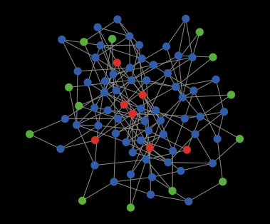

# Granovetter's threshold model of collective behaviour in a network

## WHAT IS IT?

This model reproduces [Mark Granovetter's (1978)](http://www.jstor.org/stable/2778111) threshold model of collective behavior, extended with network structures as in the model by [Watts (2002)](https://www.pnas.org/doi/abs/10.1073/pnas.082090499).

## HOW IT WORKS

Agents face a binary decision: to participate or not in a riot, following Granovetter's original example. They are represented as nodes in a network. Each agent holds a threshold representing the minimum proportion (in % terms) of its network neighbours that need to participate in the riot to be willing to enter the riot itself. In each round, agents check whether this condition is satisfied and, in case, begin to riot themselves. Following Watts (2002), once agents joined the riot, they never stop rioting (in contrast to Granovetter's original model). 

## HOW TO USE IT

### Installation
Install [Netlogo](https://ccl.northwestern.edu/netlogo/) (version 7). Download the .nlogox file from this repository and open it with Netlogo. In case you want to use Netlogo 6, please download the .nlogo file instead.

### Controls
The _setup_ bottom sets up the agents and the network on the basis of the parameters below. Click it just once at the beginning of the simulation.

1) **General parameters**
* The _number-of-agents_ slider allows to select the number of agents in the model.
* The _network_  chooser allows to select the network type. Current possibilities are "random", "fully connected" and "small world". Note that the fully connected model may cause the model to run slowly if too many agents are selected.
* The _threshold-distribution_ chooser allows to extract the agents' thresholds following different distributions. Current possibilities are the "constant", "uniform" and the "normal" distributions. With "constant", all agents have the same threshold, which corresponds to Watts' implementation. 
* _add-seed_ determines whether to start with _n-seeds_ random agent rioting from the start.
* _n-seeds_ sets the nubmer of seeds (if any).

2) **Network-related parameters**
* The _number-of-links_ parameter determines the degree of the network. It is only relevant for the random and small-world networks.
* The _rewire-prop_ parameter determines the proportion of links that should be rewired in the small world network following the [Watts and Strogatz's](http://www.nature.com/nature/journal/v393/n6684/abs/393440a0.html) procedure.
* The _network-layout_ switch determines whether the network should be visualized using a spring-embedding layout algorithm. When off, the layout is circular.
* The _Layout_ button reruns the layout algorithm, which may improve the layout.

3) **Threshold distribution related parameters**
* The _min-threshold_ parameter determines the minimum possible value for the agents' thresholds in case the uniform distribution is selected.
* The _maximum-threshold_ parameter determines the maximum possible value for the agents' thresholds in case the uniform distribution is selected.
* The _mean-threshold_ parameter determines the mean of the threshold distribution in case the normal distribution is selected.
* The _sd-threshold_ parameter determines the standard deviation of the threshold distribution in case the normal distribution is selected.
* The _constant-threshold_ parameter determines the threshold for the "constant" distribution setting. 

The _go_ button makes the agents choose their behaviour in the current round. It can be clicked repeatedly in order to observe the progressive spreading of the riot.

## THINGS TO NOTICE

How the riots spread under different threshold distributions and network shapes. Which are the conditions helping or hindering the spreading of the riots?

## CREDITS

This code is based on a Netlogo model originally by Giangiacomo Bravo, to be found at https://modelingcommons.org/browse/one_model/4784#model_tabs_browse_info, and considerably revised and extended by Rense Corten.
