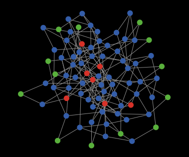

# abm4soc: Agent-Based Models for Sociology
This repository contains a number of [Netlogo](https://ccl.northwestern.edu/netlogo/) models for agent-based modeling, primarily designed for use in teaching in the sociology programs of Utrecht University. Code created or addapted and maintained by [Rense Corten](https://www.uu.nl/staff/rcorten).

The repository currently includes Netlogo implementations of:
## [Granovetter's threshold model](Granovetter-Thresholds)

## [Schelling's segregation model](Schelling-Segregation)

## [Diffusion in a small world network](Small-World-Diffusion)

