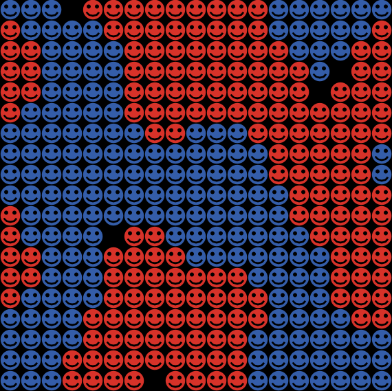

# Schelling's model of residential segregation

## WHAT IS IT?

This model is another implementation of Schelling's model of residential segregation. It is based on the project "Segregation" from netlogo's standard models library, but some respects closer to Schelling's original formulation of the model, and with some added features. As in the original version the basic assumption is that each inhabitant wants to live next to at least a given number of inhabitants of the same colour. However, in this version the inhabitants move sequentially rather then simultaniously. Moreover, inhabitants only start moving if there is a satisfactory place (patch) available for them somewhere, and settle only at places that meet their requirements. Added features are separate sliders for the preferences of both colors, and the possibility to change parameters and restart the process from an equilibrium situation.

## HOW IT WORKS

The model is a rather close imitation of Schellings original model. It consists of a "city" made of a square grid, in which two groups of "inhabitants" (or actors) live, the Reds and the Blues.  Initially, all  
inhabitants are randomly distributed around the city. Each inhabitant has a certain number of "neighbors"; these are the actors occupying the eight squares surrounding the square on which the actor "lives". Thus, each inhabitant can  
have between zero and eight neighbors.  Actually, the city is not a square but a 3-dimensional "torus", which means that the upper edge touches to lower edges and the right edge touches the left edge, such that the city has no borders. 

Now, as in Schelling's model, we let the inhabitants evaluate there current location, based on a certain preference rules. These rules determine whether an actor is happy with his current location or not.   
In this simulation, we implemented eight different preference rules. What follows is a short description of the rules for the BLUE actors, but they are symmetric for the Reds.

"1: any mixture"  
According to this rule, the blue actors are happy with every mixtures of neighbors.

"2: majority of reds"  
Blue actors are happy if the majority of their neighbors are red.

"3: blues not minority"  
Blue actors are happy if at least half of their neighbors are blue.

"4: blues are majority"  
Blue actors are happy if more than half of their neighbors are blue.

"5: no reds"  
Blue actors are happy only if they have no red neighbors at all.

"6: full of blues"  
Blue actors are happy only if they have eight blue neighbors.

"7: egual numbers of reds and blues"  
Blue actors are happy only if they have as many blue neighbors as they have red neighbors. 

"8: percentages"  
This is actually not really a rule. It means that the preference is determined by a certain percentage, which you have to set separately (as we'll explain below).  
Blue actors are happy only if the share of similar (=blue) neighbors is AT LEAST this percentage. Thus, if the percentage is set at 40%, Blues are happy with their location if 40% or more of their neighbors are also Blues.

The dynamic process works as follows: In every step, every inhabitant decides  
whether she is happy with her current location or not (you will see their faces  
change accordingly). Then, the computer checks how many empty places exist that  
would satisfy the preferences of Reds and Blues, respectively. Next, one  
unhappy actor is randomly selected. If there are places available, she will  
start to move around in a random fashion until she has found a place that  
satisfies her preferences. This process is repeated until:  
- There are no good places for Blue Left, OR all Blues are happy  
AND  
- There are no good places for Red Left, OR all Reds are happy.  
(Verify for yourself that this is indeed an equilibrium).

## HOW TO USE IT

## 1. CHOOSE THE BASIC SETTINGS

Use the slider labeled "Number of inhabitants" to set the total number of inhabitants in the city, and the %-BLUE slider to change the percentage of blue inhabitants. Use the "rule-red" and "rule-blue" buttons to choose the preferences of the red and blue inhabitants, respectively. If you change the "Type of rule" button to "%-(Left)",  you can use the sliders on the left to choose the preferences as percentages rather than rules. When you're done, click the SETUP button once, which creates a random starting situation.   
(This will not change anything on the screen yet). When you're done, press the "Setup" button in the section "Controls" (pressing "s" on your keyboard also works).   
This will create a starting situation according to your specifications, with the blue and red inhabitants distributed randomly across the city.

## 2. CHOOSE THE INHABITANTS' PREFERENCES

Now choose how the inhabitants evaluate  
their neighborhoods. You can change the preferences of both the red and blue  
inhabitants separately, using the drop-down menus named "rule-red" and  
"rule-blue", under "Rules" in the section "Preference Settings". If you want to  
use precentages rather than fixed rules (see above), you first need to select  
Rule 8 under rules. Then, you can select a percentage using the percentage  
sliders on the right. If Rule 8 is not selected, the percentage sliders have no effect.

## 3. RUN THE SIMULATION

Now you are ready to start the simulation. Click GO (or press "g") under  
"Controls" to start the simulation. One by one unhappy inhabitants move to a  
patch that meets their requirements, as long as suitable places are available.  
To stop the process, you can click the GO button again.  After the process has  
settled down, you may change the preferences of the inhabitants, and continue  
the simulation to by pressing GO again. 

## 4. READ THE RESULTS

The "Percent Similar" monitor shows the average percentage of same-color  
neighbors for each inhabitant; this is our measure of segregation. It starts at  
about 0.5, since each inhabitant starts (on average) with an equal number of red  
and blue inhabitants as neighbors. The "Percent Unhappy" monitors show the percent  
of inhabitants that have fewer same-color neighbors than they want (and thus want  
to move) for each. The total percentage unhappy is plotted. Moreover, each  
inhabitant also shows it's mood. "Places for red" and "Places for blue" show the  
number of satisfactory places available for each color. It may happen that some  
inhabitants are still unhappy while there are no longer any places available for  
them. It that case they just don't move. 

## CREDITS AND REFERENCES

Schelling, T. (1978). Micromotives and Macrobehavior. New York: Norton.

This model is inspired on:  
Wilensky, U. (1998).  NetLogo Segregation model. http://ccl.northwestern.edu/netlogo/models/Segregation. Center for Connected Learning and Computer-Based Modeling, Northwestern University, Evanston, IL.
