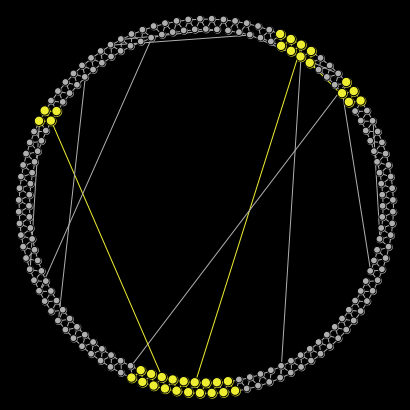

# Diffusion in a small-world network

## WHAT IS IT?

This is an SIS model on a Watts-Strogatz small world topology. Nodes are either susceptible (S) or infected (I).

## HOW IT WORKS

"This model is an adaptation of a model proposed by Duncan Watts and Steve Strogatz (1998). It begins with a network where each person (or "node") is connected to his or her two neighbors on either side... The REWIRING-PROBABILITY slider determines the probability that an edge will get rewired" (so that one of its endpoints goes to a random node instead of a neighbor).  Clicking the setup button will produce different network configurations, all with the same rewiring probability.

The prob-infection slider determines the probability that an infected individual will infect a susceptible contact at every time step.

The prob-recover slider determines the probability that an infected individual will recover and itself rejoin the susceptible population rather than infecting its neighbors.

## HOW TO USE IT

"The NUM-NODES slider controls the size of the network.  Choose a size and press SETUP.

Changing the REWIRING-PROBABILITY slider changes the fraction of nodes rewired." Press SETUP to generate the new network. SETUP will also infect one node.

Adjust the prob-infection value to determine the infectiousness of the spreading agent.

To re-infect one will infect a single individual while keeping the same topology - press "reinfect-one".

Now to allow the disease to spread, you can advance on time step at a time (each infected node will infect each of its neighbors with probability prob-infection) with the "spread once" button. To let the disease run its full course, you can click the "spread complete" button.

You can also slow down the process using the slower-faster slider at the top of the model interface.

## THINGS TO TRY

Try plotting the values for different rewiring probabilities and observe how long the infection survives in the network, and how far it spreads.

What happens as the probability of recovery increases?
What happens as the probability of infection increases?

Can you find a critical threshold in the infection and recovery probabilities such that for a given rewiring probability, below these threshold values the disease always dies out, and above the threshold value, it tends to persist in the network? In this case you are looking for the conditions under which you will observe epidemics - outbreaks that affect a significant fraction of the network, vs. conditions under which the outbreak remains small and contained.

## RELATED MODELS

See other models in the Networks section of the Models Library, such as Giant Component and Preferential Attachment. Also check out Lada's other NetLogo models:
http://www-personal.umich.edu/~ladamic/netlogo/

## CREDITS AND REFERENCES

This model was adapted from: Wilensky, U. (2005).  NetLogo Small Worlds model.  http://ccl.northwestern.edu/netlogo/models/SmallWorlds.  Center for Connected Learning and Computer-Based Modeling, Northwestern University, Evanston, IL.

It was written by Lada Adamic and Eytan Bakshy in 2007 and 2008. This version adapted for Netlogo 6 by Rense Corten.